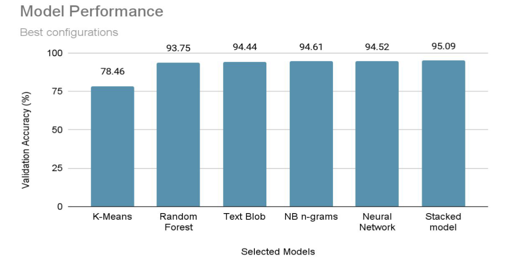
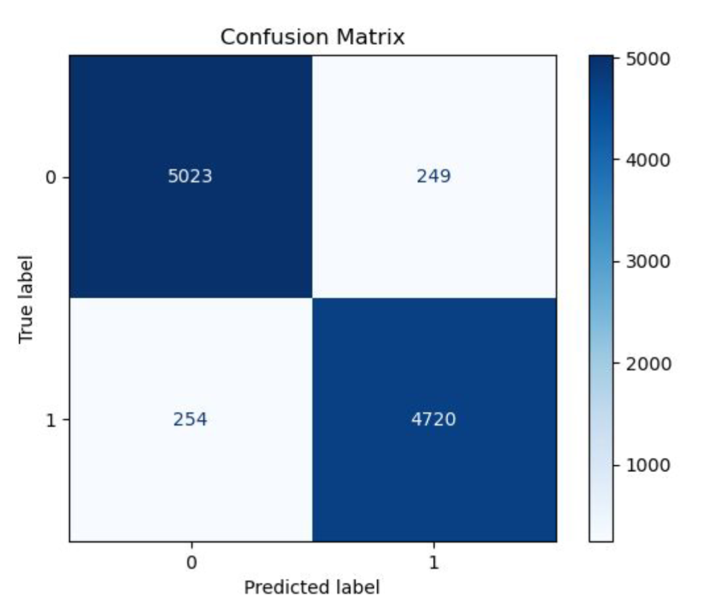

This project was part of a 9-week training course I attended in 2024.
- **Bootcamp**: Ironhack [AI Engineering bootcamp](https://www.ironhack.com/de-en/artificial-intelligence/remote)
- **Date**: September to November 2024
- **Teammates**: [Katharina](https://github.com/Katharina-code), [Luis](https://github.com/luislague)
- **Project topics**: NLP, classifier, supervised learning, sentiment analysis

Final Grade and teacher's feedback:
```
- Presentation: Well done, clean. Good visualizations of the architecture and results
- Tried the usual models, then went a bit further. Good exploration of alternatives
- Code: Your code to calculate the final score does not return the same result as mine. I think that the pd.merge() is not correctly identifying all rows, because your merged_df only has 2389 rows and it should have 9984.
- Code: Very clean code and nicely encapsulated. It was easy to read.
- Good takeaways
- Summary: Great job, great results. You tried new and interesting techniques. Your accuracy gap between validation and testing was very small, indicating that your model was properly fit

Final grade: 10 / 10

These are the values when comparing your predictions with the real labels:  
You achieved the best recall in class, congratulations! It was very close. You finished ahead by only 0.0015 (0.15%). Another group beat you to accuracy, by only 0.002 (0.2%)"
- Accuracy: 0.9358
- Precision: 0.9055
- Recall: 0.9686
- F1 Score: 0.9360
```

----

# NLP Project | Fake News Classifier

Build a classifier to differenciate real news from fake news using a kaggle dataset of labeled news.


## Project Results

In this project, we processed a dataset of real/fake news and explored different ML models and vectorizing methods to classify them.

We achieved the best results using a stacked model approach:
- Multinomial NB
- Bernouilli NB
- Complement NB 
- Random Forest
- Meta Classifier: Logistic Regression
- Validation accuracy of 95% 

Here's a chart comparing the tested models, as well as a confusion matrix of the best one (stacked):




## Installation
Use **requirements.txt** to install the required packages to run the notebooks. It is advised to use a virtual environment.
```bash
python -m venv .venv
.venv/Scripts/activate
pip install -r requirements.txt
```

## Files description

### NOTEBOOKS
- **data_exploration.ipynb**: This notebook loads and explore the dataset
- **model_training_1.ipynb**: In this notebook we try different ML classifiers and clustering models using Bag of Word and Tf-idf encodings
- **model_training_2.ipynb**: In this notebook we are using ngrams when encoding words using BoW or Tfidf, to try to retain some context for a better classification
- **model_training_3.ipynb**: In this notebook we are exploring the impact of using word embeddings on training the previous notebooks models
- **model_training_4.ipynb**: In this notebook we are exploring the TSME clustering methods
- **model_training_5.ipynb**: In this notebook we are exploring Neural Networks
- **model_training_6_BEST_MODEL.ipynb**: This is our final delivery notebook combining preprocessing, training our best model and predicting on the test dataset

### FILES
- **helpers.py**: Custom module of helper methods to simplify loading/saving datasets, pickling files, cleaning and vectorizing data.
- **requirements.txt**: List of modules required to run the notebooks (see Installation).

### DOCUMENTS
- **gp2_nlp_project_presentation.pdf**: Presentation slides